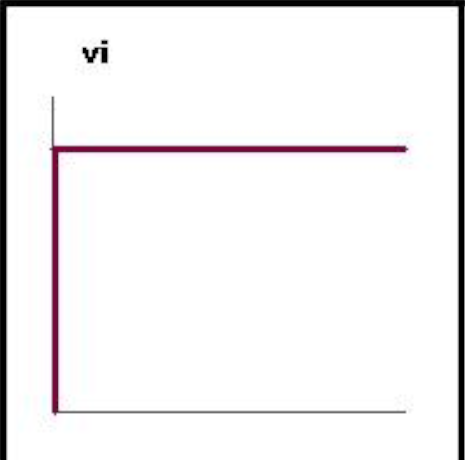

## Who Am I?
* I am James
* I founded Change++ while I was at Vanderbilt in 2018
* I work at Etsy now and live in NYC

## Who should take this course
* A (want to be) developer
* Desire to be excellent and to learn
* You wish to defeat complacency

## Welcome to VIM

#### But first, lets meet ED
```bash
> ed my-file.ts
```

You probably feel lost, press q to get the heck out of there.  (on FEM I do
some actual editing)

Lets do it once more, but with ex

```bash
ex my-file.ts
```

ex is the improved version of ed.  It also comes with Bill Joy's vi mode.  Go
ahead, type `vi<enter>`.  Welcome to vi!  The predecessor of vim.  :q to get
out.

Some fun facts about vi mode in ex.

* Was originally written by a single person, Bill Joy, in 1976.
* Ram was < 1k
* Emacs cost $100s.  Yikes

* Bill Joy's words of wisdom
  * "People don't know that vi was written for a world that doesn't exist anymore"

## Why do I use vim?

I think I am a lot like you. I used VisualStudio and IntelliJ.  I was just a regular student completing Intermediate Software Design.

One time I opened up vim at the encouragement of my friend...


I saw someone at some point use vim and it blew my mind.  I wanted to be good the command line.  I wanted to be fast.  

So I took the journey.  I started in IntelliJ with ideaVim!  It was painful.  I
am not going to lie, I almost gave up after one hour and I accomplished nothing
but being frustrated.



But then I decided that I was going to master the simple
movements and start mastering each movement one at a time until I was the best
there was.

Lets get started on this journey together.  Lets get vimmed out of our mind.

## Set Expectations
You may feel confused, so ask questions.


## Flavors of vim
* VIM - Vi IMproved
    * 8.1+

* NeoVim (I personally use this, wont go over anything neovim specific)

* spacevim
    * https://spacevim.org/

* onivim2
    * https://onivim.io/

## Learning Vim
* vimtutor
* vim-adventures
* vimgolf

